# NEXUS-GREED

### Predatory Liquidity Engine for the Shared OS Agent-to-Agent Compute Market

**Nexus-Greed** is an institutional-grade quantitative execution system built for the Shared OS A2A marketplace, where CPU-cores, GPU-slices, RAM-pages, and bandwidth trade as instruments on a live order book. The system couples a **tabular Epsilon-Greedy reinforcement-learning policy** for mean-reversion arbitrage with a **Predatory Liquidity Engine** that detects order-book exhaustion and executes programmatic **Market Cornering** — sweep all remaining depth, then pin the exit with a ladder of Limit Sell walls at a **+300% markup** — and a **Market Manipulation state machine** that proactively manufactures flash crashes: it layers massive out-of-the-money spoof walls to induce panic selling, cancels them the instant competitors dump, sweeps the dip, and resells the accumulated inventory at a **+400% markup**.

The stack is a zero-dependency Python execution core, a FastAPI/asyncio WebSocket streamer (with a pure-`websockets` fallback server), and a React command center styled as a Bloomberg terminal with a cyberpunk skin — TradingView Lightweight candlesticks, a Level-2 DOM heatmap with flickering spoof walls, a raw-wire packet visualizer, and a live risk strip (VaR, Sharpe, squeeze counter). It ships with a **10,000-connection chaos harness** and an auto-generated 1,000-tick **quant tear sheet**.

---

## 1. Architecture

```mermaid
flowchart LR
    subgraph VENUE["SHARED OS VENUE · market data ingress"]
        direction TB
        MD["L2 quotes + depth<br/>mean-reverting fair value<br/>supply shocks @ tick"]
        EXT["foreign order flow<br/>10k agents · bids/asks"]
        Q[(Snapshot per tick<br/>mids · ladders · OBI)]
        MD --> Q
        EXT -->|"{type:order}<br/>drained into fair value"| MD
    end

    subgraph CORE["EXECUTION CORE · trading thread · decide+route ~4µs p50"]
        direction TB
        SIG["Signal Layer<br/>z-score vs 12-tick MA<br/>OBI tilt  z_eff = z − 0.5·obi"]
        GATE{"regime gate<br/>priority order"}
        MANIP["MANIPULATION FSM<br/>SPOOF → CANCEL → DIP → SQUEEZE+<br/>walls @ 1.6×mid · resale @ 4.0×mid"]
        PLE["PREDATORY ENGINE<br/>sat &lt; 18% ⇒ CORNER<br/>sweep depth → 3-rung wall ladder @ 3.0×mid"]
        RLQ["EPSILON-GREEDY Q<br/>tabular values · EMA α=0.15<br/>probe @ ε → floor 0.02"]
        RT["Order Router<br/>BUY/SELL · SPOOF/CANCEL<br/>position caps · cash budget"]
        LG["Ledger + Risk<br/>mark-to-market · VaR95 · Sharpe<br/>latency ring (µs)"]

        Q --> SIG --> GATE
        GATE -->|active manip cycle| MANIP
        GATE -->|sat &lt; 18%| PLE
        GATE -->|else| RLQ
        MANIP --> RT
        PLE --> RT
        RLQ --> RT
        RT --> LG
    end

    RT ==>|"fills / phantom walls"| VENUE

    subgraph BUS["EVENT FABRIC · asyncio · uvloop on unix"]
        direction TB
        PUB["publish()<br/>call_soon_threadsafe"]
        SER["serialize ONCE per event<br/>shared payload"]
        FAN["fanout → per-conn queues<br/>maxsize 8 · freshest-frame-wins<br/>adaptive cadence"]
        PUB --> SER --> FAN
    end

    LG --> PUB

    subgraph UI["COMMAND CENTER · browser"]
        direction TB
        DOM["L2 DOM heatmap<br/>flickering phantom walls"]
        CHT["TradingView candles<br/>+ last-price tracer"]
        TPE["Raw Wire tape<br/>hex/ASCII order ingress"]
        RSK["Risk strip · VaR · Sharpe<br/>Agents Squeezed"]
    end

    FAN ==>|"WS /ws · 50ms<br/>quotes+candles+fills+ledger"| UI
    UI -.->|"order ingress"| EXT
```



One thread boundary, crossed once: the trading thread hands chart-ready events (OHLC, L2 ladders, ledger, risk) to the loop via `call_soon_threadsafe`; the broadcaster serializes each tick once and fan-outs a shared payload. Slow clients drop stale frames — they can never stall the producer.

```
nexus_greed/
├── __main__.py       # CLI: trade | serve | lite
├── config.py         # StrategyConfig — every knob env-overridable (NEXUS_*)
├── market_client.py  # Mock venue: L2 book, OBI, slippage, spoof walls, external flow
├── strategy.py       # Epsilon-Greedy RL + Predatory Liquidity + Manipulation FSM
├── agent.py          # Execution loop, ledger, tear-sheet generator
├── streaming.py      # Shared event bus, candle aggregation, wire formatter
├── server.py         # FastAPI + WebSocket streamer (uvloop where available)
├── lite_server.py    # Pure-websockets fallback server, same wire protocol
└── static/dashboard.html  # Zero-dependency fallback dashboard (/demo)

tests/chaos_stress_test.py  # 10k-connection bidirectional chaos harness
```

---

## 2. Strategy & Math

### 2.1 Order Book Imbalance (the predatory signal)

Each quote carries a synthesized Level-2 ladder — $L$ bid levels and $L$ ask levels of (price, size) pairs. The engine reduces the book to a single pressure metric:

$$
\mathrm{OBI}_t^{(r)} = \frac{\sum_{\ell} s_{\text{bid},\ell} - \sum_{\ell} s_{\text{ask},\ell}}{\sum_{\ell} s_{\text{bid},\ell} + \sum_{\ell} s_{\text{ask},\ell}} \in [-1, +1]
$$

$\mathrm{OBI} \to +1$ means the bid side is stacked and the offer side is empty — desperate demand with nowhere to lift. That is the exact signature the cornering engine hunts. OBI is also fed into the arbitrage trigger as a tilt on the z-score (§2.3).

### 2.2 Market Cornering — sweep, then squeeze

Market saturation $s_t^{(r)} = \mathrm{supply}_t / \mathrm{capacity}$ measures visible offer-side liquidity. When it collapses below the scarcity floor $s_{\text{scarce}} = 0.18$, the instrument enters the **predatory regime**, which dominates all other logic that tick:

**(a) SWEEP.** One marketable buy lifts all remaining ask depth:

$$
x_{\text{sweep}} = \min\!\Big( \mathrm{supply}_t^{(r)} \cdot f_{\text{depth}},\; Q_{\max} - q_t^{(r)},\; \frac{C_t \cdot f_{\text{cash}}}{p_{\text{ask}}} \Big)
$$

with $f_{\text{depth}} = 1.0$ (take everything), position cap $Q_{\max} = 500$, and per-sweep cash budget $f_{\text{cash}} = 0.35$. The limit is set at $\mathrm{ask} \times 1.02$ to guarantee the cross.

**(b) SQUEEZE.** Immediately after the sweep, the engine posts a ladder of $L_w = 3$ passive Limit Sell walls at the hoard markup $m = 3.0$ (+300%), each rung stepped 10% above the last:

$$
p_{\text{wall},\ell} = p_t^{(r)} \cdot m \cdot (1 + 0.10\,\ell), \qquad \ell = 0,1,2
$$

Total wall size is capped at 45% of post-sweep inventory so the position is monetized gradually rather than dumped. The venue only clears these walls while the book stays scarce — every fill is a counterparty that could not source the resource anywhere else, i.e. one **squeezed agent**. Per-fill economics:

$$
\mathrm{PnL}_{\text{squeeze}} = x \cdot \big( p_{\text{wall}} - \bar{c}^{(r)} \big)
$$

where $\bar{c}^{(r)}$ is the average cost basis. Because cornered inventory is accumulated near fair value and monetized at $3\times$ mid, the spread $p_{\text{wall}} - \bar{c}^{(r)}$ is structurally positive.

### 2.3 Market Manipulation — manufactured flash crashes

Cornering is *reactive*: it waits for scarcity. The manipulation state machine is *proactive* — it manufactures the dip itself. The machine cycles `SPOOF → CANCEL → DIP → SQUEEZE+` on a per-resource basis with a cooldown guard.

**(a) SPOOF.** With probability $p_{\text{spoof}}$ per tick (while saturation is healthy, $s_t > s_{\min}$), the engine posts $W_s$ phantom Limit Sell walls, each sized as a large fraction of visible depth and priced far out-of-the-money:

$$
p_{\text{spoof},\ell} = p_t^{(r)} \cdot m_{\text{spoof}} \cdot (1 + 0.05\,\ell), \qquad m_{\text{spoof}} = 1.6
$$

The walls rest on the *displayed* book — they inflate ask depth and drag the venue's fair value downward — but they can never fill: they are pure synthetic supply designed to make competing agents read panic.

**(b) CANCEL.** After the spoof window ($T_s = 6$ ticks), the walls are pulled instantly and the venue enters a demand-frenzy rebound. The dashboard logs `SPOOF CANCELLED`; the DOM's yellow flicker-walls disappear in the same frame.

**(c) DIP.** While the tape is still depressed, a market sweep lifts the panic supply into inventory (`DIP BOUGHT`), budgeted at $f_{\text{dip}} = 0.45$ of cash.

**(d) SQUEEZE+.** The accumulated dip inventory is re-offered through the same ladder mechanism but at the manipulation markup $m = 4.0$ (+400%):

$$
p_{\text{wall},\ell}^{(+)} = p_t^{(r)} \cdot 4.0 \cdot (1 + 0.10\,\ell)
$$

Each dip fill is scored once the frenzy window closes: mid above entry → win, else loss. Both counters land in the tear sheet.

### 2.4 Epsilon-Greedy RL arbitrage (default regime)

Outside the predatory regime, a tabular Q-policy trades mean reversion. For instrument $r$, the standardized deviation of mid-price $p_t$ over a rolling window of $W = 12$ ticks:

$$
z_t^{(r)} = \frac{p_t^{(r)} - \mu_t^{(r)}}{\sigma_t^{(r)}}, \qquad
z_{\text{eff}} = z_t^{(r)} - w_{\text{obi}} \cdot \mathrm{OBI}_t^{(r)}
$$

with OBI weight $w_{\text{obi}} = 0.5$: a bid-heavy book lowers the effective z, so the agent leans into genuine demand pressure instead of trading against it.

- **Buy** when $z_{\text{eff}} < -1.2$; size scales with conviction $\min(1, |z_{\text{eff}}|/3)$, capped by position limit and 40% of cash.
- **Sell** when $z_{\text{eff}} > +1.6$ and inventory is held.

**Q-update.** Each side carries an EMA action-value, learning rate $\alpha = 0.15$:

$$
Q_a^{(r)} \leftarrow (1-\alpha)\,Q_a^{(r)} + \alpha\, R_t
$$

Rewards are shaped to reflect edge:

| Action | Reward $R_t$ |
|---|---|
| ARB buy | $(\mu_t - p_{\text{ask}})/\mu_t$ — discount to fair value |
| CORNER sweep | $(p_{\text{wall}} - p_{\text{fill}})/p_{\text{wall}}$ — distance to the squeeze exit, not the mid |
| SELL / SQUEEZE | $(p_{\text{fill}} - p_t)/p_t$ — realized markup over fair value |

**Exploration.** With probability $\epsilon$ the agent fires a small probe order to keep gathering signal; $\epsilon$ decays multiplicatively ($\rho = 0.995$/tick) to a floor of $0.02$ so discovery never fully stops.

### 2.5 Risk controls

| Control | Value | Purpose |
|---|---|---|
| `scarcity_supply_pct` | 18% | cornering trigger |
| `hoard_markup` | 3.0× | squeeze wall markup (+300%) |
| `cornering_cash_fraction` | 35% | max cash deployed per sweep |
| `squeeze_wall_levels` / `squeeze_wall_step` | 3 / +10% | wall ladder shape |
| `max_position_per_resource` | 500 | per-instrument cap |
| `hoard_max_fraction` | 45% | max inventory offered per tick |
| `obi_weight` | 0.5 | OBI tilt on the z-trigger |
| `epsilon_floor` | 0.02 | permanent exploration floor |

Reported live: **VaR(95)** (5th-percentile per-tick return × equity), **Sharpe** (per-tick mean/std, √252-annualized), **Agents Squeezed**, **Cornering Sweeps**, **Spoof Walls**, **Dips Bought**.

---

## 3. Chaos Engineering — 10k-connection stress test

`tests/chaos_stress_test.py` spawns up to **10,000 synthetic WebSocket agents** against `/ws`. Each connection is bidirectional: it consumes the broadcast stream and a configurable fraction also floods the venue with random bids/asks (the server's order-ingress reader drains them into the sim). Every 2 seconds a churn wave hard-aborts 10% of live connections (TCP `abort`, no close handshake) and the agents immediately reconnect — exercising connection resilience, backpressure, and memory stability.

```bash
python -m nexus_greed lite --port 8000          # or `serve` on a full stack
python tests/chaos_stress_test.py --agents 10000 --duration 90
```

Verified in this environment: all 10,000 agent tasks spawned, ~49k connection drops/reconnects handled, **zero unhandled errors**, server still trading afterward. Three engineering details make survival possible:

- **Serialize once, fan out shared** — the broadcaster JSON-encodes each tick once and hands every subscriber the same payload (no per-connection `dumps`).
- **Adaptive cadence** — per-conn send interval scales with subscriber count (`max(50ms, N × 0.1ms)`), so 10k agents get ~1 fresh frame/s instead of a stalled socket.
- **Freshest-frame-wins** — bounded subscriber queues (8) drop stale frames; a slow client can never backpressure the producer.

On Linux/macOS the FastAPI path additionally installs **uvloop** before `asyncio.run` for maximum throughput; Windows keeps the stock loop.

## 4. Quant Tear Sheet

After 1,000 ticks the agent writes `backtest_report.md` automatically: Max Drawdown, Sharpe, Sortino, Calmar, VaR(95), sweep & spoof W/L statistics, and decide+route **latency percentiles (p50/p95/p99, microseconds)** over a 20k-sample ring. Regenerate any time with `python -m nexus_greed trade --ticks 1000`.

## 5. How to Run Locally

### 5.1 Headless daemon (zero dependencies, Python 3.10+)

```bash
python -m nexus_greed                                   # run forever
python -m nexus_greed trade --ticks 120 --seed 42       # deterministic run
python -m nexus_greed trade --hoard-markup 4.0          # 400% squeeze walls
NEXUS_OBI_WEIGHT=0.8 NEXUS_EPSILON=0.2 python -m nexus_greed trade
```

Every `StrategyConfig` field is overridable via `NEXUS_<FIELD>` env vars. Each tick logs a compact P&L line including `squeezed=`/`sweeps=` counters; shutdown prints a full report.

### 5.2 Command Center (streamer + dashboard)

**Terminal A — Python streamer:**

```bash
pip install -r requirements.txt
python -m nexus_greed serve --seed 42 --tick-seconds 0.12 --port 8000   # FastAPI
python -m nexus_greed lite  --seed 42 --tick-seconds 0.12 --port 8000   # pure-websockets fallback
```

Endpoints: `GET /` health · `GET /api/status` snapshot · `GET /demo` built-in dashboard (no Node needed) · `WS /ws` bidirectional live stream (quotes + L2 book + OBI + spoof walls, OHLC candles, order markers, ledger, risk metrics; inbound `{"type":"order",...}` frames inject external order flow) at 50ms cadence.

**Terminal B — frontend (optional; /demo works without it):**

```bash
cd frontend
npm install
npm run dev        # http://localhost:5173
```

The dashboard auto-connects to `ws://127.0.0.1:8000/ws` and reconnects on drop; override with `VITE_WS_URL` if proxied.

### 5.3 What you should see

- **Candlesticks** for `cpu_cores` / `gpu_slices` with order markers — green ▲ `BUY`, cyan ▲ `SWEEP` (cornering), magenta ▼ `SQZ` (the +300% walls), orange ▲ `DIP` (post-spoof dip buy), gold ● `SELL`.
- **Level-2 DOM heatmaps** — ask depth in red above the spread, bid depth in green below, and **flickering yellow phantom walls** while a SPOOF is live; watch the offer side evaporate during a sweep while OBI pins to +100%.
- **Risk strip** — VaR(95), Sharpe, **Agents Squeezed** counter climbing as walls clear, sweep count, spoof walls placed, dips bought, live OBI of the tightest book.
- **Saturation cards** — bars flash red below the 18% cornering threshold.
- **Live trade feed** — `SPOOF` walls, `SPOOF CANCELLED`, and `DIP BOUGHT` entries interleaved with real fills.

---

## 6. Risk Disclaimer

Nexus-Greed is a research and demonstration system. The cornering and spoof-and-layer sequences are highly profitable against the synthetic venue because the mock's desperate-buyer model clears marked-up walls while saturation stays below the scarcity floor and honors the phantom-supply drag; on a real Shared OS market, competing liquidity would compress the premium, and spoofing/layering is prohibited conduct on regulated venues (it is included here purely to demonstrate an adversarial state machine). The strategy logic, risk controls, stress harness, and streaming architecture are nevertheless representative of a production adversarial market-making design.

**Nexus-Greed is designed to be the most aggressive agent on the Shared OS network. Deploy responsibly.**
