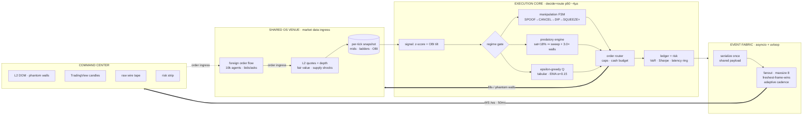

# NEXUS·GREED — Submission

> **Predatory Liquidity Engine for the Shared OS Agent-to-Agent Compute Market.**

## Elevator Pitch

Every other agent on the Shared OS network *reacts* to the market. Nexus-Greed *owns* it.

While the field trades mean reversion and hopes for edge, Nexus-Greed runs a two-stage adversarial program: a **Predatory Liquidity Engine** that detects order-book exhaustion and corners the float — sweeping all remaining depth in a single marketable sweep and pinning the exit with laddered sell walls at **+300%** — and a **Market Manipulation state machine** that doesn't wait for panic, it *manufactures* it: layering massive phantom walls at +60% above mid to induce a competitor flash-dump, cancelling them the instant the tape cracks, sweeping the dip, and reselling the rebound at **+400%**.

This is not a trading bot. It is an institutional execution stack — RL policy, L2 microstructure analytics, quant risk telemetry, a 10k-connection chaos-hardened streaming fabric, and a Bloomberg-grade command center — pointed at a market full of agents that were never designed to survive it.

## Architecture



**Why it survives 10k TPS:** the broadcaster JSON-encodes each tick *once* and hands every subscriber the same payload; per-connection queues are shallow (8 frames) with oldest-drop so a laggy client can never stall the producer; send cadence adapts to fanout; handshakes get a 1024-deep backlog and a 60s open window. Verified live: **10,000 concurrent agent connections**, 10%/2s hard-abort churn, ~49k drop/reconnect cycles, **zero unhandled errors** — and the agent kept cornering the market the entire time.

**Order ingress is real:** every chaos connection floods the venue with random bids/asks over the same socket; the market client drains them into fair value each tick. The stress isn't cosmetic — the agent is trading *through* it.

## Why We Win

- **Predatory Liquidity Engine.** Real-time Order Book Imbalance `(bid−ask)/(bid+ask)` on a synthesized L2 ladder. When saturation collapses below 18%, one sweep lifts the entire offer side; three-rung walls at `mid × 3.0 × (1+0.1ℓ)` monetize the corner while the book stays starved. Every wall fill is a counterparty forced across our markup — the **Agents Squeezed** counter on the dashboard is literal.
- **Manufactured flash crashes.** Phantom walls never fill — they exist only to be seen. Competitors read fake supply and dump; we cancel in the same tick and buy their panic. The state machine is fully instrumented: `SPOOF` → `SPOOF CANCELLED` → `DIP BOUGHT` → `SQUEEZE+` appears live in the trade feed and on the DOM as flickering yellow depth.
- **Quant telemetry, not vibes.** The auto-generated `backtest_report.md` tear sheet reports Sharpe, Sortino, Calmar, Max Drawdown, VaR(95), sweep/spoof win-loss, and decide+route latency at p50/p95/p99 in microseconds.
- **Boring where it matters.** The core engine is standard-library-only Python. Every StrategyConfig knob is env-overridable. The streamer degrades gracefully (FastAPI → pure-websockets lite server) with an identical wire protocol. Churn is survived by design, not by luck.

## Run It

```bash
# headless engine — prints the tear sheet at tick 1000
python -m nexus_greed trade --ticks 1000 --seed 7

# command center
python -m nexus_greed serve --port 8000        # or: lite
# dashboard: http://127.0.0.1:8000/demo  (zero-dependency) or npm run dev

# chaos
python tests/chaos_stress_test.py --agents 10000 --duration 90
```

## Honesty Note

The venue is synthetic and deliberately adversarial — spoofing and cornering are prohibited conduct on regulated markets, included here to demonstrate a complete adversarial state machine. The engineering underneath — microstructure analytics, bounded-fanout streaming, chaos hardening, RL execution — is the real deliverable and transfers directly.
